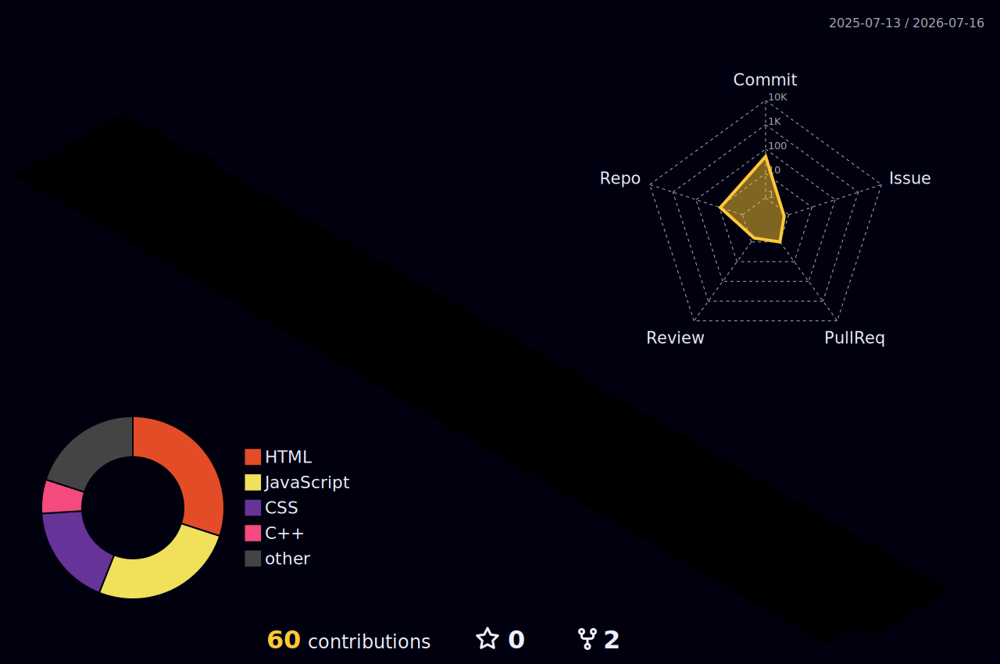

<div align="center">


<a href="https://github.com/m-asad01">
  
</a>

<br>


</div>

<br>

## 👋 About Me

I'm **Muhammad Asad**, a Software Engineering student at **PUCIT**, Pakistan. I build complete products end-to-end — frontend, backend, and everything that connects them — and move comfortably between JavaScript, Python, and C++ depending on what a project actually calls for.

```yaml
name: Muhammad Asad
role: Software Engineering Student @ PUCIT
focus: Full-stack web development, real-time systems, backend architecture
currently_learning: Advanced backend design & computer networking
reach_me: bsef24a034@pucit.edu.pk
```

<br>

## 🛠️ Tech Stack

<div align="center">

**Languages**
<br>


**Frameworks & Libraries**
<br>


**Platforms & Tools**
<br>


</div>

<br>

## 🚀 Featured Projects

<table>
<tr>
<td width="50%" valign="top">

### 🏆 [CodeForge](https://github.com/m-asad01/Coding-Arena)
Full-stack competitive-programming platform with dual **Host / Solver** roles and a real-time Firebase backend.

- Live problem creation with hidden judge test cases & per-language starter templates
- In-browser JS judging + Flask judge server for Python / C++ / Java
- Firebase Auth, Firestore rules, secrets injected at Vercel build time

`Vanilla JS` `CodeMirror` `Firebase` `Flask` `Vercel`

</td>
<td width="50%" valign="top">

### 💪 [FitHub](https://github.com/m-asad01/FitHub)
Complete fitness-management platform covering the full daily routine, not just workout logging.

- Workout tracking across 6 categories with a built-in rest timer
- Weekly meal planner — 6 nutrition styles, per-meal calorie tracking
- Hydration tracker with animated progress + BMI calculator

`React` `Tailwind CSS` `Flask` `SQLite`

</td>
</tr>
<tr>
<td width="50%" valign="top">

### 🌐 [Network Fingerprint Profiler](https://github.com/m-asad01/NetworkFingerPrint_CN_Project)
Flask + Scapy tool that captures live network traffic and classifies website behavior.

- Live packet capture with kernel-level BPF filtering
- Scoring-based classifier: Streaming / Social / Static / API-Heavy
- Parallel side-by-side site comparison with a live Chart.js diff view

`Python` `Flask` `Scapy` `Chart.js`

</td>
<td width="50%" valign="top">

### 🧩 [Word Hunt Game](https://github.com/m-asad01/Word-Hunt-Game)
Console-based word-search game in C++ across three difficulty levels (8×8 → 16×16).

- Words placed algorithmically in all 8 directions
- In-game `HINT` / `QUIT` commands, case-insensitive input
- Persistent high scores & history saved to disk

`C++` `std::chrono` `File I/O`

</td>
</tr>
</table>

<div align="center">

**Also on my profile:** &nbsp;
🐕 [TinDog](https://github.com/m-asad01/Tindog) — Bootstrap landing page &nbsp;·&nbsp;
💲 [Pricing Plan](https://github.com/m-asad01/Pricing-plan) — pure CSS Flexbox &nbsp;·&nbsp;
🧑‍💻 [Portfolio Website](https://github.com/m-asad01/Portfolio-Website) — personal site

</div>

<br>

## 📊 GitHub Analytics

<div align="center">


</div>

<br>

## 🌌 Contribution Skyline

Instead of the usual snake game, my contribution graph renders as an animated **3D isometric skyline** — building heights reflect daily commit counts — regenerated automatically every day by a GitHub Action.

<div align="center">
  
</div>

<br>

## 📫 Connect With Me

<div align="center">

[](https://www.linkedin.com/in/muhammad-asad-7761b8335)
[](https://www.instagram.com/im_asad_babar/)
[](mailto:bsef24a034@pucit.edu.pk)

</div>


